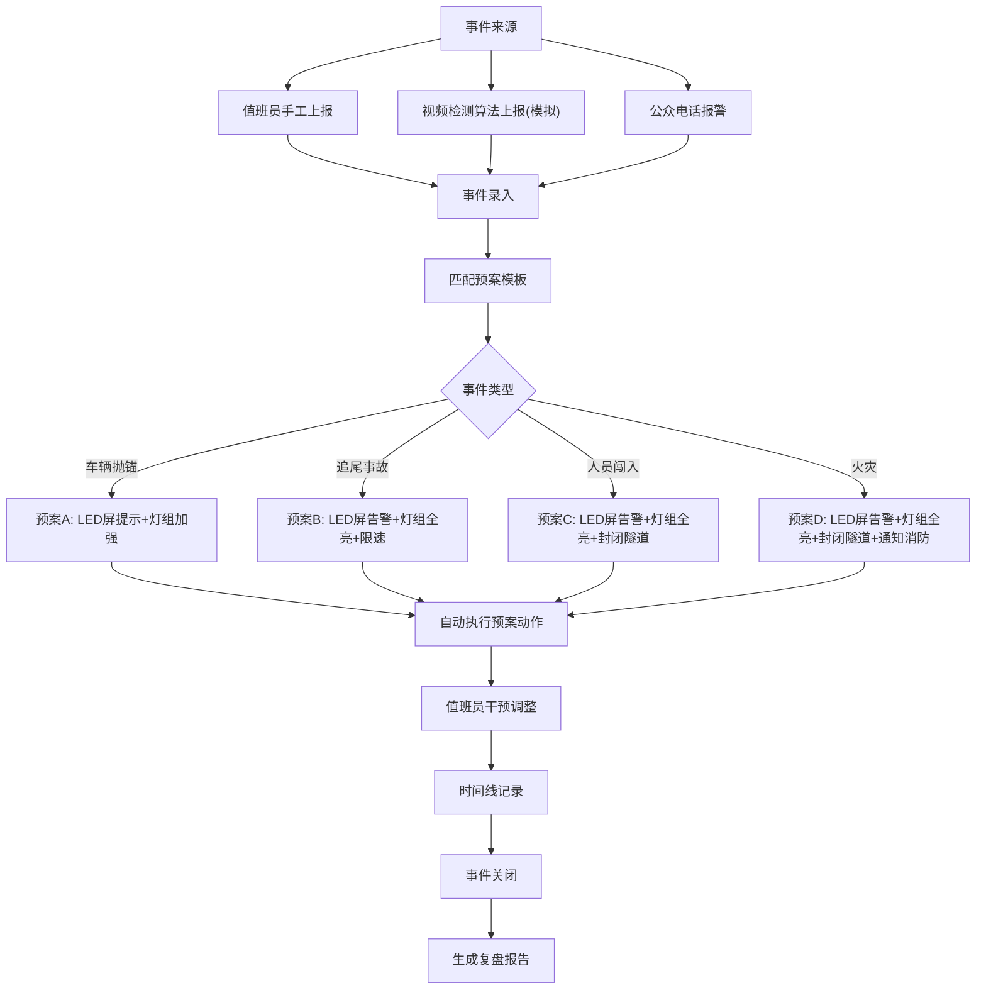

## 1. 产品概述

隧道交通事件检测系统是一套面向高速公路隧道运营管理单位的事件检测与应急指挥平台。系统整合值班员手工上报、视频检测算法自动上报（模拟）和公众电话报警三类事件来源，实现从事件发现、录入、预案自动触发到处置执行、干预调整、全流程时间线记录的闭环管理，确保隧道内异常事件在数十秒内被发现并启动应急响应，事后可生成精确到秒的复盘报告。

- 目标用户：高速公路隧道监控中心值班员、运营管理人员
- 核心价值：将隧道事件的发现—响应—处置时间压缩到分钟级以内，通过模板化预案自动触发降低人为遗漏风险，全过程留痕支撑事后追责与流程优化

## 2. 核心功能

### 2.1 用户角色

| 角色 | 注册方式 | 核心权限 |
|------|----------|----------|
| 值班员 | 管理员分配账号 | 上报事件、执行/调整预案、查看时间线 |
| 管理员 | 系统初始账号 | 全部权限，含预案模板管理、复盘报告导出、用户管理 |

### 2.2 功能模块

1. **事件监控大屏**：隧道实时状态总览、最新事件告警、设备状态、待处置事件统计
2. **事件管理**：事件列表（多条件筛选）、事件录入（三来源）、事件详情查看
3. **应急处置**：预案自动触发、处置动作执行、值班员手动干预调整
4. **预案模板管理**：预案模板的增删改查、动作配置（LED屏、照明、封闭等）
5. **时间线与复盘**：事件处置时间线（精确到秒）、复盘报告生成与导出

### 2.3 页面详情

| 页面名称 | 模块名称 | 功能描述 |
|----------|----------|----------|
| 事件监控大屏 | 隧道状态地图 | 以隧道示意图展示各区段状态，标记事件位置里程桩 |
| 事件监控大屏 | 实时告警 | 滚动显示最新上报的事件，含闪烁告警动效 |
| 事件监控大屏 | 统计卡片 | 今日事件数、待处置数、已处置数、平均响应时长 |
| 事件监控大屏 | 设备状态 | LED屏、灯组当前工作状态一览 |
| 事件管理 | 事件列表 | 按来源/类型/严重等级/状态/时间筛选，支持搜索 |
| 事件管理 | 事件录入 | 选择来源（手工/视频检测/公众报警），填写位置、类型、严重等级、描述 |
| 事件详情 | 基本信息卡 | 事件编号、位置、类型、等级、来源、上报人、上报时间 |
| 事件详情 | 处置操作面板 | 自动触发预案的动作列表，可手动确认/跳过/调整 |
| 事件详情 | 实时时间线 | 以时间轴形式展示每个处置动作的触发时间、执行状态 |
| 事件详情 | 设备操控 | LED屏内容编辑、灯组亮度调整、隧道封闭/解封开关 |
| 预案管理 | 模板列表 | 按事件类型分组的预案模板，显示关联动作数 |
| 预案管理 | 模板编辑 | 增删动作步骤，配置动作参数（如LED屏文字、灯组亮度） |
| 复盘报告 | 报告列表 | 已关闭事件的复盘报告，支持按时间范围筛选 |
| 复盘报告 | 报告详情 | 完整时间线、每个动作的执行人与时间戳、响应时长分析 |
| 复盘报告 | 导出 | 一键导出PDF复盘报告 |

## 3. 核心流程

值班员或系统自动上报事件 → 事件录入（位置/类型/等级/来源） → 系统根据事件类型匹配预案模板 → 自动触发预案动作（LED屏告警/灯组全亮/封闭隧道） → 值班员可实时干预调整 → 每步操作记录精确时间线 → 事件关闭后生成复盘报告

## 4. 用户界面设计

### 4.1 设计风格

- **主色调**：深蓝黑（#0A1628）为底，警橙（#FF6B35）为告警强调色，冰蓝（#00D4FF）为信息色，翠绿（#00E676）为正常状态色
- **按钮风格**：圆角矩形（8px），主要操作用实色填充，次要操作用边框样式
- **字体**：标题用 DIN Alternate（数字感强），正文用 Noto Sans SC
- **布局风格**：左侧固定导航栏 + 右侧内容区，卡片式模块布局，监控大屏为全屏沉浸式
- **图标风格**：线性描边图标，2px 线宽，与深色主题匹配
- **整体风格**：工业监控指挥中心风格，深色主题，数据密集但不杂乱，告警信息醒目

### 4.2 页面设计总览

| 页面名称 | 模块名称 | UI要素 |
|----------|----------|--------|
| 事件监控大屏 | 隧道状态地图 | 深色背景，隧道横向长条示意图，事件位置用红色标记脉冲，正常区段用绿色渐变，深蓝底+发光效果 |
| 事件监控大屏 | 实时告警 | 右侧滚动列表，新告警闪烁橙色边框渐消，含类型图标+时间+简述 |
| 事件监控大屏 | 统计卡片 | 四列卡片，大号数字+小号标签，数字带动态计数动效 |
| 事件管理 | 事件列表 | 表格布局，顶部筛选栏（下拉+日期范围），行按严重等级着色（红/橙/黄/蓝） |
| 事件管理 | 事件录入 | 右侧抽屉滑出，表单含级联选择（隧道→里程桩），来源用图标区分 |
| 事件详情 | 基本信息卡 | 顶部信息卡片，左侧等级色条，网格布局展示字段 |
| 事件详情 | 处置操作面板 | 中间区域，动作列表每行含序号+动作名+状态徽章+操作按钮 |
| 事件详情 | 实时时间线 | 右侧纵向时间轴，圆点+连线，每个节点展示时间戳（精确到秒）和动作描述 |
| 事件详情 | 设备操控 | 底部区域，LED屏预览+文字编辑器，灯组亮度滑块，封闭开关用大型拨动开关 |
| 预案管理 | 模板列表 | 卡片网格，每张卡片显示事件类型图标+关联动作数+启用状态 |
| 预案管理 | 模板编辑 | 左右分栏，左侧步骤列表可拖拽排序，右侧参数配置表单 |
| 复盘报告 | 报告列表 | 表格+时间范围筛选，含响应时长柱状图缩略图 |
| 复盘报告 | 报告详情 | 顶部概览卡片，中部完整时间线，底部响应分析图表，右上角导出按钮 |

### 4.3 响应式设计

- 桌面优先设计，最小适配1280px宽度
- 监控大屏专为大屏（1920x1080+）优化
- 事件详情页在中等屏幕下时间线从右侧切换到底部

### 4.4 动效设计

- 新事件告警：橙色脉冲光圈从事件位置扩散
- 预案触发：动作项从上到下依次亮起，带 0.3s 间隔的级联动效
- 时间线节点：新节点出现时从左侧滑入 + 微弹跳
- 统计数字：页面加载时从 0 计数到目标值
- 设备操控：开关切换带滑动光效
