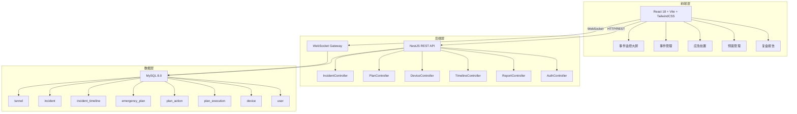
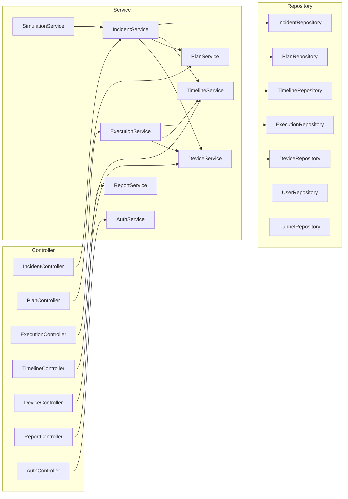
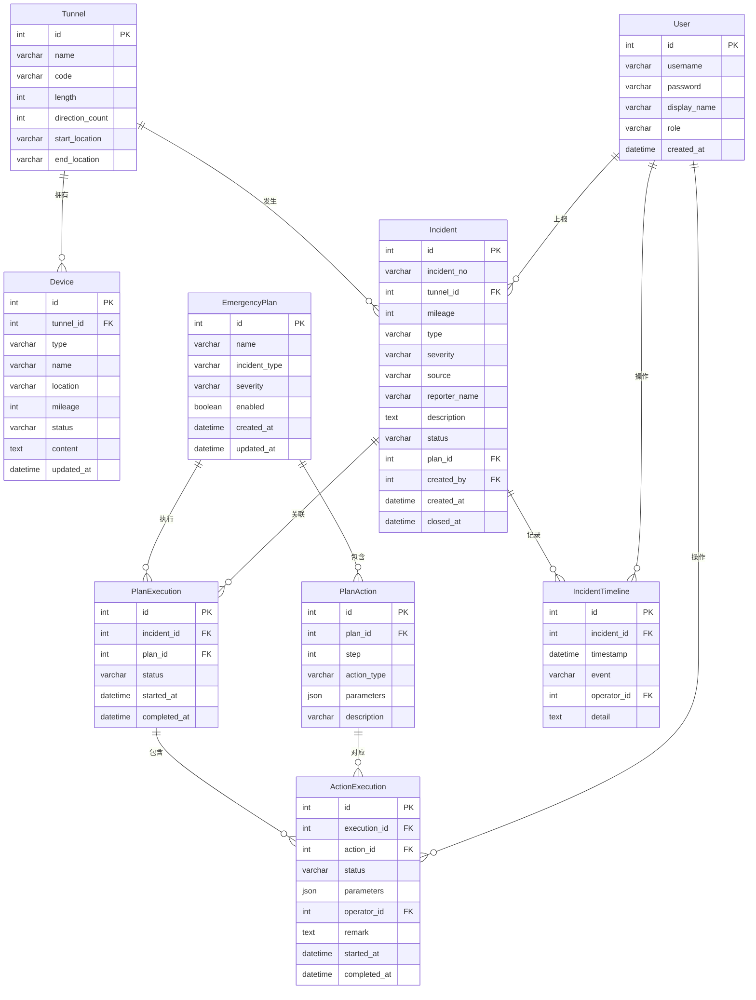

## 1. 架构设计



## 2. 技术说明

- **前端**：React@18 + TailwindCSS@3 + Vite + TypeScript
- **前端状态管理**：Zustand
- **前端HTTP客户端**：Axios
- **前端图表**：Recharts
- **初始化工具**：Vite
- **后端**：NestJS + TypeScript
- **ORM**：TypeORM
- **数据库**：MySQL 8.0（localhost:3306，密码：123456，用户：root）
- **实时通信**：Socket.IO（WebSocket）
- **认证**：JWT（Passport策略）
- **日志**：NestJS内置Logger（debug级别全开）

## 3. 路由定义

| 路由 | 用途 |
|------|------|
| `/` | 事件监控大屏 |
| `/incidents` | 事件列表 |
| `/incidents/new` | 事件录入 |
| `/incidents/:id` | 事件详情与处置 |
| `/plans` | 预案模板列表 |
| `/plans/:id/edit` | 预案模板编辑 |
| `/reports` | 复盘报告列表 |
| `/reports/:id` | 复盘报告详情 |
| `/login` | 登录页 |

## 4. API 定义

### 4.1 认证模块

```
POST   /api/auth/login          # 登录
GET    /api/auth/profile        # 获取当前用户信息
```

### 4.2 事件模块

```typescript
interface CreateIncidentDto {
  tunnelId: number;
  mileage: number;
  type: IncidentType;
  severity: Severity;
  source: IncidentSource;
  reporterName?: string;
  description: string;
}

enum IncidentType {
  BREAKDOWN = 'breakdown',
  REAR_END = 'rear_end',
  INTRUSION = 'intrusion',
  FIRE = 'fire',
  WRONG_WAY = 'wrong_way',
  DEBRIS = 'debris',
}

enum Severity {
  MINOR = 'minor',
  MODERATE = 'moderate',
  MAJOR = 'major',
  CRITICAL = 'critical',
}

enum IncidentSource {
  MANUAL = 'manual',
  VIDEO_DETECTION = 'video_detection',
  PUBLIC_REPORT = 'public_report',
}

interface IncidentVo {
  id: number;
  incidentNo: string;
  tunnelId: number;
  tunnelName: string;
  mileage: number;
  type: IncidentType;
  severity: Severity;
  source: IncidentSource;
  reporterName: string;
  description: string;
  status: IncidentStatus;
  createdAt: string;
  closedAt?: string;
}

enum IncidentStatus {
  PENDING = 'pending',
  RESPONDING = 'responding',
  RESOLVED = 'resolved',
  CLOSED = 'closed',
}
```

```
GET    /api/incidents              # 事件列表（支持筛选）
GET    /api/incidents/:id          # 事件详情
POST   /api/incidents              # 创建事件
PATCH  /api/incidents/:id/status   # 更新事件状态
POST   /api/incidents/simulate     # 模拟视频检测上报
```

### 4.3 预案模块

```typescript
interface CreatePlanDto {
  name: string;
  incidentType: IncidentType;
  severity: Severity;
  actions: CreatePlanActionDto[];
}

interface CreatePlanActionDto {
  step: number;
  actionType: ActionType;
  parameters: Record<string, any>;
}

enum ActionType {
  LED_DISPLAY = 'led_display',
  LIGHT_FULL = 'light_full',
  LIGHT_ENHANCE = 'light_enhance',
  TUNNEL_CLOSE = 'tunnel_close',
  TUNNEL_OPEN = 'tunnel_open',
  NOTIFY_FIRE = 'notify_fire',
  NOTIFY_MEDICAL = 'notify_medical',
  SPEED_LIMIT = 'speed_limit',
}
```

```
GET    /api/plans                  # 预案模板列表
GET    /api/plans/:id              # 预案模板详情
POST   /api/plans                  # 创建预案模板
PUT    /api/plans/:id              # 更新预案模板
DELETE /api/plans/:id              # 删除预案模板
```

### 4.4 处置执行模块

```typescript
interface ExecutePlanDto {
  incidentId: number;
  planId: number;
}

interface AdjustActionDto {
  actionId: number;
  status: ActionStatus;
  parameters?: Record<string, any>;
  remark?: string;
}

enum ActionStatus {
  PENDING = 'pending',
  EXECUTING = 'executing',
  COMPLETED = 'completed',
  SKIPPED = 'skipped',
  ADJUSTED = 'adjusted',
  FAILED = 'failed',
}
```

```
POST   /api/executions             # 触发预案执行
GET    /api/executions/incident/:id # 获取事件的执行记录
PATCH  /api/executions/:id/actions/:actionId # 调整处置动作
```

### 4.5 时间线模块

```
GET    /api/timelines/incident/:id  # 获取事件时间线
```

```typescript
interface TimelineEntry {
  id: number;
  incidentId: number;
  timestamp: string;
  event: string;
  operator: string;
  detail: string;
}
```

### 4.6 设备模块

```
GET    /api/devices                 # 设备列表
GET    /api/devices/:id             # 设备详情
PATCH  /api/devices/:id             # 更新设备状态
GET    /api/devices/tunnel/:id      # 获取隧道下所有设备
```

```typescript
interface Device {
  id: number;
  tunnelId: number;
  type: DeviceType;
  location: string;
  mileage: number;
  status: DeviceStatus;
  content?: string;
}

enum DeviceType {
  LED_SCREEN = 'led_screen',
  LIGHT_GROUP = 'light_group',
  BARRIER = 'barrier',
  CAMERA = 'camera',
}

enum DeviceStatus {
  ONLINE = 'online',
  OFFLINE = 'offline',
  MALFUNCTION = 'malfunction',
}
```

### 4.7 复盘报告模块

```
GET    /api/reports                 # 报告列表
GET    /api/reports/:id             # 报告详情
GET    /api/reports/:id/export      # 导出报告
```

### 4.8 隧道模块

```
GET    /api/tunnels                  # 隧道列表
GET    /api/tunnels/:id              # 隧道详情
```

### 4.9 WebSocket 事件

```typescript
// 服务端推送
'incident:created'       // 新事件创建
'incident:updated'       // 事件状态更新
'execution:progress'     // 预案执行进度
'device:status'          // 设备状态变更
'timeline:new'           // 新时间线条目
```

## 5. 服务端架构图



## 6. 数据模型

### 6.1 数据模型定义



### 6.2 数据定义语言

```sql
CREATE DATABASE IF NOT EXISTS tunnel_incident DEFAULT CHARACTER SET utf8mb4 COLLATE utf8mb4_unicode_ci;
USE tunnel_incident;

CREATE TABLE `user` (
  `id` INT NOT NULL AUTO_INCREMENT,
  `username` VARCHAR(50) NOT NULL,
  `password` VARCHAR(255) NOT NULL,
  `display_name` VARCHAR(50) NOT NULL,
  `role` ENUM('admin','operator') NOT NULL DEFAULT 'operator',
  `created_at` DATETIME NOT NULL DEFAULT CURRENT_TIMESTAMP,
  PRIMARY KEY (`id`),
  UNIQUE KEY `uk_username` (`username`)
) ENGINE=InnoDB;

CREATE TABLE `tunnel` (
  `id` INT NOT NULL AUTO_INCREMENT,
  `name` VARCHAR(100) NOT NULL,
  `code` VARCHAR(20) NOT NULL,
  `length` INT NOT NULL COMMENT '隧道长度(米)',
  `direction_count` TINYINT NOT NULL DEFAULT 2 COMMENT '方向数',
  `start_location` VARCHAR(200) NOT NULL,
  `end_location` VARCHAR(200) NOT NULL,
  PRIMARY KEY (`id`),
  UNIQUE KEY `uk_code` (`code`)
) ENGINE=InnoDB;

CREATE TABLE `device` (
  `id` INT NOT NULL AUTO_INCREMENT,
  `tunnel_id` INT NOT NULL,
  `type` ENUM('led_screen','light_group','barrier','camera') NOT NULL,
  `name` VARCHAR(100) NOT NULL,
  `location` VARCHAR(200) NOT NULL,
  `mileage` INT NOT NULL COMMENT '里程桩位置(米)',
  `status` ENUM('online','offline','malfunction') NOT NULL DEFAULT 'online',
  `content` TEXT COMMENT 'LED屏显示内容或设备参数',
  `updated_at` DATETIME NOT NULL DEFAULT CURRENT_TIMESTAMP ON UPDATE CURRENT_TIMESTAMP,
  PRIMARY KEY (`id`),
  KEY `idx_tunnel_id` (`tunnel_id`),
  CONSTRAINT `fk_device_tunnel` FOREIGN KEY (`tunnel_id`) REFERENCES `tunnel` (`id`)
) ENGINE=InnoDB;

CREATE TABLE `incident` (
  `id` INT NOT NULL AUTO_INCREMENT,
  `incident_no` VARCHAR(20) NOT NULL,
  `tunnel_id` INT NOT NULL,
  `mileage` INT NOT NULL COMMENT '里程桩位置(米)',
  `type` ENUM('breakdown','rear_end','intrusion','fire','wrong_way','debris') NOT NULL,
  `severity` ENUM('minor','moderate','major','critical') NOT NULL,
  `source` ENUM('manual','video_detection','public_report') NOT NULL,
  `reporter_name` VARCHAR(50) DEFAULT NULL,
  `description` TEXT NOT NULL,
  `status` ENUM('pending','responding','resolved','closed') NOT NULL DEFAULT 'pending',
  `plan_id` INT DEFAULT NULL,
  `created_by` INT NOT NULL,
  `created_at` DATETIME(3) NOT NULL DEFAULT CURRENT_TIMESTAMP(3),
  `closed_at` DATETIME(3) DEFAULT NULL,
  PRIMARY KEY (`id`),
  UNIQUE KEY `uk_incident_no` (`incident_no`),
  KEY `idx_tunnel_id` (`tunnel_id`),
  KEY `idx_status` (`status`),
  KEY `idx_created_at` (`created_at`),
  KEY `idx_type_severity` (`type`, `severity`),
  CONSTRAINT `fk_incident_tunnel` FOREIGN KEY (`tunnel_id`) REFERENCES `tunnel` (`id`),
  CONSTRAINT `fk_incident_user` FOREIGN KEY (`created_by`) REFERENCES `user` (`id`)
) ENGINE=InnoDB;

CREATE TABLE `emergency_plan` (
  `id` INT NOT NULL AUTO_INCREMENT,
  `name` VARCHAR(100) NOT NULL,
  `incident_type` ENUM('breakdown','rear_end','intrusion','fire','wrong_way','debris') NOT NULL,
  `severity` ENUM('minor','moderate','major','critical') NOT NULL,
  `enabled` TINYINT(1) NOT NULL DEFAULT 1,
  `created_at` DATETIME NOT NULL DEFAULT CURRENT_TIMESTAMP,
  `updated_at` DATETIME NOT NULL DEFAULT CURRENT_TIMESTAMP ON UPDATE CURRENT_TIMESTAMP,
  PRIMARY KEY (`id`),
  KEY `idx_type_severity` (`incident_type`, `severity`)
) ENGINE=InnoDB;

CREATE TABLE `plan_action` (
  `id` INT NOT NULL AUTO_INCREMENT,
  `plan_id` INT NOT NULL,
  `step` INT NOT NULL,
  `action_type` ENUM('led_display','light_full','light_enhance','tunnel_close','tunnel_open','notify_fire','notify_medical','speed_limit') NOT NULL,
  `parameters` JSON NOT NULL,
  `description` VARCHAR(200) NOT NULL,
  PRIMARY KEY (`id`),
  KEY `idx_plan_id` (`plan_id`),
  CONSTRAINT `fk_action_plan` FOREIGN KEY (`plan_id`) REFERENCES `emergency_plan` (`id`) ON DELETE CASCADE
) ENGINE=InnoDB;

CREATE TABLE `plan_execution` (
  `id` INT NOT NULL AUTO_INCREMENT,
  `incident_id` INT NOT NULL,
  `plan_id` INT NOT NULL,
  `status` ENUM('executing','completed','interrupted') NOT NULL DEFAULT 'executing',
  `started_at` DATETIME(3) NOT NULL DEFAULT CURRENT_TIMESTAMP(3),
  `completed_at` DATETIME(3) DEFAULT NULL,
  PRIMARY KEY (`id`),
  KEY `idx_incident_id` (`incident_id`),
  CONSTRAINT `fk_execution_incident` FOREIGN KEY (`incident_id`) REFERENCES `incident` (`id`),
  CONSTRAINT `fk_execution_plan` FOREIGN KEY (`plan_id`) REFERENCES `emergency_plan` (`id`)
) ENGINE=InnoDB;

CREATE TABLE `action_execution` (
  `id` INT NOT NULL AUTO_INCREMENT,
  `execution_id` INT NOT NULL,
  `action_id` INT NOT NULL,
  `status` ENUM('pending','executing','completed','skipped','adjusted','failed') NOT NULL DEFAULT 'pending',
  `parameters` JSON DEFAULT NULL,
  `operator_id` INT DEFAULT NULL,
  `remark` TEXT DEFAULT NULL,
  `started_at` DATETIME(3) DEFAULT NULL,
  `completed_at` DATETIME(3) DEFAULT NULL,
  PRIMARY KEY (`id`),
  KEY `idx_execution_id` (`execution_id`),
  CONSTRAINT `fk_action_exec_execution` FOREIGN KEY (`execution_id`) REFERENCES `plan_execution` (`id`),
  CONSTRAINT `fk_action_exec_action` FOREIGN KEY (`action_id`) REFERENCES `plan_action` (`id`),
  CONSTRAINT `fk_action_exec_user` FOREIGN KEY (`operator_id`) REFERENCES `user` (`id`)
) ENGINE=InnoDB;

CREATE TABLE `incident_timeline` (
  `id` INT NOT NULL AUTO_INCREMENT,
  `incident_id` INT NOT NULL,
  `timestamp` DATETIME(3) NOT NULL DEFAULT CURRENT_TIMESTAMP(3),
  `event` VARCHAR(100) NOT NULL,
  `operator_id` INT DEFAULT NULL,
  `detail` TEXT NOT NULL,
  PRIMARY KEY (`id`),
  KEY `idx_incident_id` (`incident_id`),
  KEY `idx_timestamp` (`timestamp`),
  CONSTRAINT `fk_timeline_incident` FOREIGN KEY (`incident_id`) REFERENCES `incident` (`id`),
  CONSTRAINT `fk_timeline_user` FOREIGN KEY (`operator_id`) REFERENCES `user` (`id`)
) ENGINE=InnoDB;

-- 初始数据
INSERT INTO `user` (`username`, `password`, `display_name`, `role`) VALUES
('admin', '$2b$10$kQ7Z8X6YQJ9J2Z3W4V5X6eJ7K8M9N0O1P2Q3R4S5T6U7V8W9X0Y1Za', '系统管理员', 'admin'),
('operator01', '$2b$10$kQ7Z8X6YQJ9J2Z3W4V5X6eJ7K8M9N0O1P2Q3R4S5T6U7V8W9X0Y1Za', '值班员张三', 'operator'),
('operator02', '$2b$10$kQ7Z8X6YQJ9J2Z3W4V5X6eJ7K8M9N0O1P2Q3R4S5T6U7V8W9X0Y1Za', '值班员李四', 'operator');

INSERT INTO `tunnel` (`name`, `code`, `length`, `direction_count`, `start_location`, `end_location`) VALUES
('青山隧道', 'QS-001', 3200, 2, 'G15沈海高速K125+300', 'G15沈海高速K128+500'),
('龙门隧道', 'LM-002', 4500, 2, 'G15沈海高速K200+100', 'G15沈海高速K204+600'),
('云岭隧道', 'YL-003', 2800, 2, 'G25长深高速K88+500', 'G25长深高速K91+300');

INSERT INTO `device` (`tunnel_id`, `type`, `name`, `location`, `mileage`, `status`, `content`) VALUES
(1, 'led_screen', '青山隧道入口LED屏', '隧道入口前方200m', 0, 'online', '正常通行'),
(1, 'led_screen', '青山隧道中段LED屏', '隧道中段', 1600, 'online', '正常通行'),
(1, 'led_screen', '青山隧道出口LED屏', '隧道出口前方100m', 3200, 'online', '正常通行'),
(1, 'light_group', '青山隧道灯组A', '隧道入口-800m', 800, 'online', '{"brightness": 50}'),
(1, 'light_group', '青山隧道灯组B', '隧道800m-1600m', 1600, 'online', '{"brightness": 50}'),
(1, 'light_group', '青山隧道灯组C', '隧道1600m-2400m', 2400, 'online', '{"brightness": 50}'),
(1, 'light_group', '青山隧道灯组D', '隧道2400m-出口', 3200, 'online', '{"brightness": 50}'),
(1, 'barrier', '青山隧道入口拦车器', '隧道入口', 0, 'online', '{"closed": false}'),
(1, 'barrier', '青山隧道出口拦车器', '隧道出口', 3200, 'online', '{"closed": false}'),
(1, 'camera', '青山隧道入口摄像头', '隧道入口', 0, 'online', NULL),
(1, 'camera', '青山隧道中段摄像头', '隧道中段', 1600, 'online', NULL),
(1, 'camera', '青山隧道出口摄像头', '隧道出口', 3200, 'online', NULL),
(2, 'led_screen', '龙门隧道入口LED屏', '隧道入口前方200m', 0, 'online', '正常通行'),
(2, 'led_screen', '龙门隧道中段LED屏', '隧道中段', 2250, 'online', '正常通行'),
(2, 'led_screen', '龙门隧道出口LED屏', '隧道出口前方100m', 4500, 'online', '正常通行'),
(2, 'light_group', '龙门隧道灯组A', '隧道入口-1500m', 1500, 'online', '{"brightness": 50}'),
(2, 'light_group', '龙门隧道灯组B', '隧道1500m-3000m', 3000, 'online', '{"brightness": 50}'),
(2, 'light_group', '龙门隧道灯组C', '隧道3000m-出口', 4500, 'online', '{"brightness": 50}'),
(2, 'barrier', '龙门隧道入口拦车器', '隧道入口', 0, 'online', '{"closed": false}'),
(2, 'barrier', '龙门隧道出口拦车器', '隧道出口', 4500, 'online', '{"closed": false}'),
(3, 'led_screen', '云岭隧道入口LED屏', '隧道入口前方200m', 0, 'online', '正常通行'),
(3, 'led_screen', '云岭隧道出口LED屏', '隧道出口前方100m', 2800, 'online', '正常通行'),
(3, 'light_group', '云岭隧道灯组A', '隧道入口-1400m', 1400, 'online', '{"brightness": 50}'),
(3, 'light_group', '云岭隧道灯组B', '隧道1400m-出口', 2800, 'online', '{"brightness": 50}'),
(3, 'barrier', '云岭隧道入口拦车器', '隧道入口', 0, 'online', '{"closed": false}'),
(3, 'barrier', '云岭隧道出口拦车器', '隧道出口', 2800, 'online', '{"closed": false}');

INSERT INTO `emergency_plan` (`name`, `incident_type`, `severity`, `enabled`) VALUES
('车辆抛锚一般预案', 'breakdown', 'minor', 1),
('车辆抛锚较大预案', 'breakdown', 'moderate', 1),
('追尾事故较大预案', 'rear_end', 'moderate', 1),
('追尾事故重大预案', 'rear_end', 'major', 1),
('人员闯入重大预案', 'intrusion', 'major', 1),
('火灾重大预案', 'fire', 'major', 1),
('火灾特别重大预案', 'fire', 'critical', 1),
('车辆逆行重大预案', 'wrong_way', 'major', 1),
('物品散落一般预案', 'debris', 'minor', 1);

INSERT INTO `plan_action` (`plan_id`, `step`, `action_type`, `parameters`, `description`) VALUES
-- 车辆抛锚一般预案
(1, 1, 'led_display', '{"text": "前方故障 慢行通过"}', '上游LED屏提示'),
(1, 2, 'light_enhance', '{"brightness": 80}', '隧道灯组增强照明'),
-- 车辆抛锚较大预案
(2, 1, 'led_display', '{"text": "前方故障 注意避让"}', '上游LED屏告警'),
(2, 2, 'light_full', '{}', '隧道灯组全亮'),
(2, 3, 'speed_limit', '{"limit": 40}', '限速40km/h'),
-- 追尾事故较大预案
(3, 1, 'led_display', '{"text": "前方事故 减速慢行"}', '上游LED屏告警'),
(3, 2, 'light_full', '{}', '隧道灯组全亮'),
(3, 3, 'speed_limit', '{"limit": 30}', '限速30km/h'),
(3, 4, 'notify_medical', '{"message": "隧道内追尾事故，需急救"}', '通知医疗急救'),
-- 追尾事故重大预案
(4, 1, 'led_display', '{"text": "前方重大事故 禁止通行"}', '上游LED屏紧急告警'),
(4, 2, 'light_full', '{}', '隧道灯组全亮'),
(4, 3, 'tunnel_close', '{"direction": "both"}', '封闭隧道双向'),
(4, 4, 'notify_medical', '{"message": "隧道内重大追尾事故，需急救"}', '通知医疗急救'),
-- 人员闯入重大预案
(5, 1, 'led_display', '{"text": "紧急：行人闯入 立即停车"}', 'LED屏紧急告警'),
(5, 2, 'light_full', '{}', '隧道灯组全亮'),
(5, 3, 'tunnel_close', '{"direction": "entry"}', '封闭隧道入口'),
(5, 4, 'speed_limit', '{"limit": 20}', '限速20km/h'),
-- 火灾重大预案
(6, 1, 'led_display', '{"text": "火灾紧急 立即停车撤离"}', 'LED屏火灾告警'),
(6, 2, 'light_full', '{}', '隧道灯组全亮'),
(6, 3, 'tunnel_close', '{"direction": "both"}', '封闭隧道双向'),
(6, 4, 'notify_fire', '{"message": "隧道内火灾，需消防支援"}', '通知消防'),
(6, 5, 'notify_medical', '{"message": "隧道内火灾，需急救"}', '通知医疗急救'),
-- 火灾特别重大预案
(7, 1, 'led_display', '{"text": "重大火灾 立即停车撤离"}', 'LED屏紧急告警'),
(7, 2, 'light_full', '{}', '隧道灯组全亮'),
(7, 3, 'tunnel_close', '{"direction": "both"}', '封闭隧道双向'),
(7, 4, 'notify_fire', '{"message": "隧道内重大火灾，紧急消防支援"}', '紧急通知消防'),
(7, 5, 'notify_medical', '{"message": "隧道内重大火灾，紧急急救"}', '紧急通知医疗'),
(7, 6, 'speed_limit', '{"limit": 0}', '全线停车'),
-- 车辆逆行重大预案
(8, 1, 'led_display', '{"text": "逆行车辆 紧急避让"}', 'LED屏紧急告警'),
(8, 2, 'light_full', '{}', '隧道灯组全亮'),
(8, 3, 'tunnel_close', '{"direction": "entry"}', '封闭隧道入口'),
(8, 4, 'speed_limit', '{"limit": 0}', '紧急停车'),
-- 物品散落一般预案
(9, 1, 'led_display', '{"text": "前方散落物 注意避让"}', '上游LED屏提示'),
(9, 2, 'light_enhance', '{"brightness": 80}', '隧道灯组增强照明');
```
